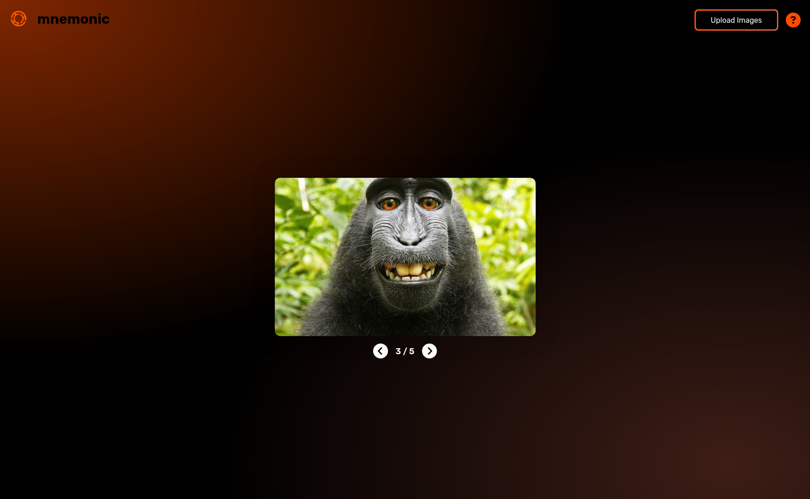

<p align="center">
  <a href="https://paste.photos/">
    
  </a>
</p>

<h1 align="center">Mnemonic</h1>

[Mnemonic](https://paste.photos/) is a web application that turns your images into interactive flashcards.

This tool was made for those moments when you have a folder full of images you need to study. Instead of the hassle of printing them, cutting them out, and writing on the back, you can **simply upload them to Mnemonic and start studying instantly.**



## Getting Started

Follow these instructions to get a copy of the project up and running on your local machine for development.

### Prerequisites

Make sure you have [Bun](https://bun.sh/) installed on your system.

### Installation & Development

1. **Clone the repository** (if you haven't already):

   ```bash
   git clone https://github.com/Cuerillius/Mnemonic
   cd mnemonic
   ```

2. **Install dependencies:**

   ```bash
   bun install
   ```

3. **Run the development server:**
   ```bash
   bun run dev
   ```
   The application will be available at `http://localhost:5173/Mnemonic/`.

## Building for Production

To create a production-ready build of the app, run the following command:

```bash
bun run build
```

This will compile the project and place the generated files in the `dist` directory. These files are ready to be deployed to a static web host.
